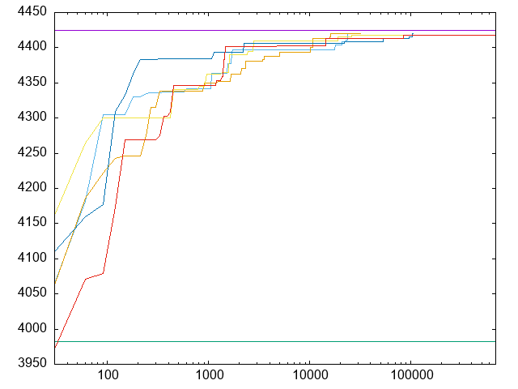
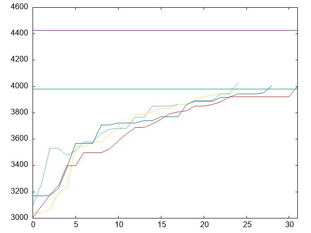

# ナップサック問題に対するGAとDPの性能比較実験
R3年度 創造実験
## 実験者
熊本高専 人間情報システム工学科 縄田研究室 甲斐主陸

## 実験目的
* ***GA*(遺伝的アルゴリズム)** の実装や適用について，**0-1ナップサック問題**に対して適用すことで理解する
* 他手法との比較，今回の実験では0-1ナップサック問題を *O(NW)* で解ける*DP*(動的計画法)と比較することにより，GAの優位性や特徴を理解する
## 概要
* **0-1ナップサック問題**
* **遺伝的アルゴリズム**の基本
* **動的計画法**及び*0-1*ナップサック問題に対する適用

以上3点についてはここでは特に記載しない．
また，*0-1*ナップサック問題について，以下のとおりとする．
* *N*: 荷物の個数
* *W*: 重さの合計の上限
* *w_max*: 任意の荷物の重さの最大値
* *v_max*: 任意の荷物の価値の最大値
* 荷物*i*は価値*v_i*, 重さ*w_i*

*GA*の適用については発表スライドに詳細があるので参照されたい．

以降，`%%`で囲まれている場所にはその値が入ります．

各ファイルの内容は以下の通り．
* `Baggage.java`: ナップサック問題の対象となる荷物群
* `CreateDataset.java`: ナップサック問題の対象データをファイルとして作成
* `DPMain.java`: DPを実行，計測
* `DynamicPrograming.java`，`DynamicPrograming2.java`: DP本体
* `GAMain.java`: GAを実行，計測．各世代で最もスコアが高い遺伝子のスコアをファイルに出力．出力先は`./results/%N%/%W%/`
* `GeneticAlgorithm.java`: 遺伝的アルゴリズム本体
* `Gtype.java`: 遺伝子
* `Main.java`: DPとGAを一緒に実行していた時の残り物，大した意味はない

## 実験手順
1. `CreateDataset.java`で対象のデータセットを作成
    * `CreateDataset.java`を実行すると`Count`，`MaxCost`，`MaxValue`の入力を求められるのでそれぞれ`N`，`w_max`，`v_max`を入力
    * 今回は，*N=100,1000,10000，w_max=100,1000,10000*，の計3通りを用意した
    * `v_max`は*GA*と*DP*の実行時間に関係せず，オーバーフローも怖いのですべて*100*
2. `DPMain.java`で*DP*の実行結果を求める
    * コマンドライン引数で対象データセットのパスと`w_max`を与えて実行する
    * 実行コマンドは以下の通り
```
java DPMain %dataset% %W%
```
3. `GAMain.java`で*GA*の実行結果を求める
    * コマンドライン引数で対象データセットのパス，`W`，*GA*で求めたい解の値(入力以上の値になるまで繰り返される)を入力
    * プログラムをいじって以下のパラメーターを設定
        * `geneCount`: 個体数
        * `maxGeneration`: 最終的に使用していないが，メソッドのオーバライドで世代数による制限に対応している
    * 実行コマンドは以下の通り
```
java GAMain %dataset% %W% %answer%
```
4. 実行結果をプロットしたい場合は`plot/`の中にある`gnuplot`のスクリプトを使用
    * データが多すぎると言われた場合は，いくつおきにプロットするかを指定

## 実験結果
*GA*の実行結果はそれぞれ5回実行し，実行時間による中央値をとっている．
### *N=100, W=3000*で*DP*の結果に一致するまで実行
||*DP*|*GA(100)*|*GA(1000)*|*GA(10000)*|
|:-:|-:|-:|-:|-:|
|**実行時間[ms]**|6|4954|10582|17459|
|**世代数**|-|104413|42943|33357|
|**出力**|4425|4425|4425|4425|

* 総組み合わせ数は *2^100* なので，**世代数×個体数** はかなり小さい
* *DP*の*N×W* より**世代数×個体数**は大きい
* *DP*に比べてかなり遅い

この画像は個体数100の収束の過程


*DP*による最適解の*90*%(上のグラフの緑のライン)には探索のかなり序盤で到達しているので，精度を抑えた解を得る実験を行うことにした．

### *N=100, W=3000*で*DP*の結果の90%を上回るまで実行
||*DP*|*GA(100)*|*GA(1000)*|*GA(10000)*|
|:-:|-:|-:|-:|-:|
|**実行時間[ms]**|6|47(0.9%)|57(0.5%)|73(0.4%)|
|**世代数**|-|24(0.03%)|13(0.03%)|13(0.04%)|
|**出力**|4425|4024|4013|3992|

* *100*%を求めた場合より更に小さい**世代数×個体数**
* *DP*の*NW*より小さい**世代数×個体数**
* まだ*DP*にくらべると遅い

この画像は個体数100の収束の過程


速い．かなり速い．というかこの条件で*90*%の解が得られるの正直驚いた．

### *N=1000, W=300000*で*DP*の結果の90%を上回るまで実行
||*DP*|*GA(100)*|*GA(1000)*|*GA(10000)*|
|:-:|-:|-:|-:|-:|
|**実行時間[ms]**|1198|284|546|814|
|**世代数**|-|381|169|119|
|**出力**|45010|40540|40572|40549|

### *N=10000, W=30000000*で*DP*の結果の90%を上回るまで実行
||*DP*|*GA(100)*|*GA(1000)*|*GA(10000)*|
|:-:|-:|-:|-:|-:|
|**実行時間[ms]**|1245766|130784|14785|183056|
|**世代数**|-|27325|5842|3590|
|**出力**|435617|392056|392088|392078|

## 考察・まとめ
### *0-1*ナップサック問題に対する実行結果の比較
以下の表に簡単にまとめる．

||GA|GP|
|:-:|:-:|:-:|
|**実行速度**|大きいNかつそこそこの解で高速|そこそこのNとWで高速|
|**解**|スコアと組み合わせ|スコアのみ|

詳細には以下．
* 全体的に
    * **単純かつ*N*が小さい*0-1*ナップサック問題**に*GA*は**非効率的**
        * パラメータ増やして複雑にしたら*GA*の方が強力そう
        * *N*が大きく，欲しい精度がある程度低い場合では*GA*の方が強力
    * 計算量に影響するパラメータ
        * *DP*では*N*と*W*
        * *GA*では*N*と個体数，世代数等*GA*の設定
* 優位性について
    * そこそこの解がそれなりに高速に求まる
    * 解がスコアだけでなく組み合わせも得られる
        * *DP*は現在の実装ではスコアしか求まらず，組み合わせを得るような実装をするとおそらくもう少し遅くなる
    * 空間計算量が結構小さく収まった
* 問題点，考慮すべき点
    * *GA*のみでは最適解である確証を得られない
        * そもそも最適解を求めるのに向いているのか？
    * 簡単な問題を*GA*で解く意義は恐らく無．例えばナップサック問題なら，以下のような条件に当てはまるかは一考してよいと考える
        * *N*×*W* が大きすぎる
            * 許容できる実行時間と相談
        * パラメータが多く複雑
            * 下手にやろうとすると，**パラメータ数=*DP*の次元数** になって地獄

### *GA*について
* 局所解が怖い
    * 実験結果をプロットしたグラフの通りで，ある程度よい結果になってくると，それ以上によい遺伝子が見つかりづらくなるようだ
    * 実装がおそらくよくない
        * 次世代の生成についてもう少し練るべき
        * たぶんエリート選択あたりに改善の余地があって類似する遺伝子がどんどん増えてるんじゃないかと考えている
* 個体数が増えると実行時間が伸びる
    * エリート選択の中にソートが入ってるから多分その影響